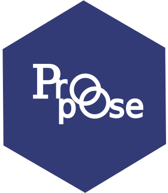

# *propose*: a Shiny app for proposing and evaluating targeted intervention scenarios in an emerging epidemic or pandemic using the {ringbp} R package 

> [!WARNING]
> Under active development

## Install {propose}

```r
# check whether {pak} is installed
if (!require("pak")) install.packages("pak")
pak::pak("joshwlambert/propose")
```

## {ringbp} R package

The epidemic simulation model used in `{propose}` is from the [`{ringbp}` R package](https://github.com/epiforecasts/ringbp). `{ringbp}` is an open source R package hosted on the [epiforecasts GitHub organisation](https://github.com/epiforecasts) and can be installed from GitHub using:

```r
# check whether {pak} is installed
if (!require("pak")) install.packages("pak")
pak::pak("epiforecasts/ringbp")
```

## Help

To report a bug please open an
[issue](https://github.com/joshwlambert/propose/issues/new).

## Related projects

* [DAEDALUS Explore](https://daedalus.jameel-institute.org/) and the epidemiological model [DAEDALUS](https://jameel-institute.github.io/daedalus/) are similar to `{propose}` and its epidemiological model `{ringbp}`. DAEDALUS is an integrated health-economics model, to model the health, education, and economic costs of directly transmitted respiratory virus pandemics, under different scenarios of prior vaccine investment, policy interventions, and public behavioural change. The website app allows for running scenarios and comparing scenarios across countries, disease, responses, and other factors.

* [exploreringbp](https://github.com/epiforecasts/exploreringbp/tree/master) is a Shiny app that was developed alongside the initial development of the `{ringbp}` package. It allowed for running scenarios under different parameterisations and plotting aspects of simulated outbreaks using `{ringbp}`. exploringringbp is not actively maintained and is not currently compatible with the recent updates in `{ringbp}`.

